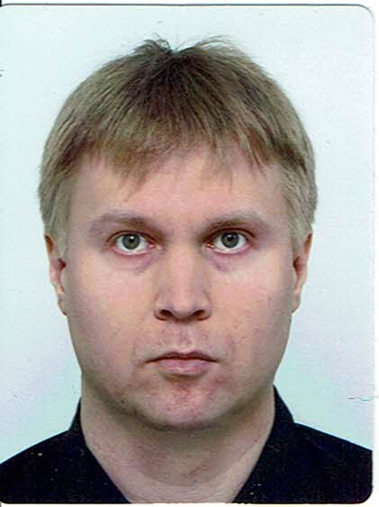
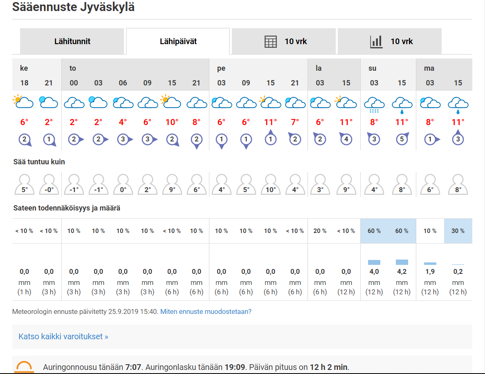

# Curriculum Vitae

**Sukunimi, Etunimi:** *Solonen, Vesa*

**Syntymäaika:** *05.08.1980*

**Puhelin:** *040-1202296*

**Osoite:** *Harjannetie 3 D 35*  
*40900 SÄYNÄTSALO*

**Kansallisuus:** *Suomi*

**Kielitaito:** *suomi(äidinkieli), englanti(hyvä), ruotsi(välttävä)*


## Koulutus:

**Tutkinto:** *Tietotekniikka, Insinööri (AMK)*  
*Jyväskylän ammattikorkeakoulu*  
*27.08.2003 - 03.06.2009*

**Pääaineet:** *(Tietoturva, järjestelmien hallinta, käyttöjärjestelmät sekä laajakaista- ja WAN-tekniikat)*

**Opinnäyte:** *Windows Server 2008 oppimispaketti*

**Tutkinto:** *Tietotekniikka, Radio, TV ja Video -asentaja*  
*Jyväskylän tekninen ammattioppilaitos*  
*15.08.1996 - 31.05.1999*

## Työkokemus:

**Työnantaja:** *HuKi Jyväskylä Ry*  
**Työaika:** *01.10.2012 - 31.05.2013*  
**Tehtävä:** *Huhtaharjun koulun ilta- ja viikonloppuvalvonta*

**Työnantaja:** *Mediapex Oy*  
**Työaika:** *12.03.2012 - 29.05.2012*  
**Tehtävä:** *Puhelinmyynti*

**Työnantaja:** *KM-Valu Ky*  
**Työaika:** *25.07.2006 - 01.09.2006*  
**Tehtävä:** *Pienmetallivalutuotteiden jälkikäsittely*

**Työnantaja:** *Finndomo Oy*  
**Työaika:** *16.05.2005 - 26.08.2005*  
**Tehtävä:** *Taloelementtien lastaus ja pientavaran niputus*

**Työnantaja:** *Jakeluporras Oy*  
**Työaika:** *04.08.2004 - 28.08.2004*  
**Tehtävä:** *Mainosten jakaminen*

**Työnantaja:** *Keski-Suomen tietokonepalvelu - Neverstop Oy*  
**Työaika:** *29.10.2001 - 29.04.2002*  
**Tehtävä:** *Tietokoneiden kasaus, huolto ja asiakaspalvelu*

**Työnantaja:** *Finndomo Oy*  
**Työaika:** *07.06.1999 - 29.10.1999*  
**Tehtävä:** *Pientavaran niputtaja lähetyksessä*

**Työnantaja:** *Jyväskylän kaupunki*  
**Työaika:** *30.06.1997 - 11.07.1997*  
**Tehtävä:** *Puistojen ja viheralueiden kesätyöt*



# :partly_sunny: Sää

# :school: Opintoni:

| **opintojaksotunnus** | **opintojaksonnimi** | **opintopistemäärä** | **ryhmä**  | **lukukausi** |
| :-------------------- | :------------------- | :------------------: | :--------- | ------------: |
|  TTZW0410             |  [*Git -versionhallinta ja Gitlab -projektien hallintaympäristö*](https://asio.jamk.fi/pls/asio/asio_ectskuv1.kurssin_ks?ktun=TTZW0410&knro=&noclose=%20&lan=f) |  1op                 | TTK19S1DEV | syksy         |
|  XXYY1234             |  *Testiopintojakso*  |  0op                 | TTK19S1DEV | syksy         |

# :movie_camera: [Terminator 2 - Tuomion päivä (1991)](https://www.imdb.com/title/tt0103064/)
### :speech_balloon: Quote
``` 
John Connor : No, no, no, no. You gotta listen to the way people talk. You don't say "affirmative," or some shit like that. You say "no problemo." And if someone comes on to you with an attitude you say "eat me." And if you want to shine them on it's "hasta la vista, baby."

The Terminator : Hasta la vista, baby.

John Connor : Yeah but later, dickwad. And if someone gets upset you say, "chill out"! Or you can do combinations.

The Terminator : Chill out, dickwad.

John Connor : Great! See, you're getting it!

The Terminator : No problemo.

```
# :video_camera: Esimerkkivideo: 


